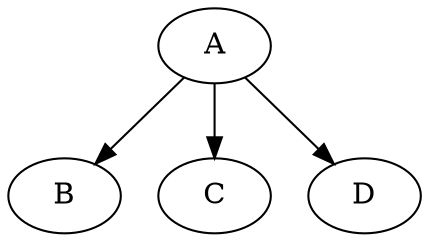

# graphene-chain-mutation

Provide feature to allow chaining mutations using [Graphene-python](https://docs.graphene-python.org/en/latest/quickstart/)

I created this package after [a question I asked on Stackoverflow](https://stackoverflow.com/questions/61340137/graphene-graphql-how-to-chain-mutations/) and that I had to solve by myself in the end.

`graphene-chain-mutation` allow to create edge-like mutations that can reference the results of previous mutations in the same query.

## Why this package ?

### The requirement

Basically, when want to be able to create an object and reference it in the same query. We can use nested mutations at some extend, but it have been pointed ([here](https://www.freecodecamp.org/news/organizing-graphql-mutations-653306699f3d/) and [there](https://github.com/graphql-python/graphene/issues/944#issuecomment-492462389)) that nested mutation are not guaranteed to be sequential. So if we consider a query using nesting, like the following:

```graphql
mutation ($parent: ParentInput, $child1: ChildInput, $child2: ChildInput) {
    n1: upsertChild(data: $child1) {
        pk
        name
        siblings { pk name }
        
        parent: createParent(data: $parent) { pk name }
        
        newSibling: createSibling(data: $child2) { pk name }
        
        # we cannot set the parent of the new sibling in this query
        # because order is not guaranted for nested mutations
    }
}
```

We see that we cannot set the parent of the new sibling because the latter may be created before the parent.

So we want to use only root query, and maybe be able to make queries such as:

```graphql
mutation ($parent: ParentInput, $child1: ChildInput, $child2: ChildInput) {
    n1: upsertParent(data: $parent) {
        pk
        name
    }
    
    n2: upsertChild(data: $child1) {
        pk
        name
    }
    
    n3: upsertChild(data: $child2) {
        pk
        name
    }
    
    e1: setParent(parent: "n1", child: "n2") { ok }
    
    e2: setParent(parent: "n1", child: "n3") { ok }
    
    e3: addSibling(node1: "n2", node2: "n3") { ok }
}
```

Where e1, e2 and e3 reference results of previous mutations.

### The problem

Unfortunately, referencing results of previous mutations is not part of the GraphQL specification.

In my opinion, this is an important feature for graph languages. We can compare this syntax with the Graphviz dot language, were could write for example:



The feature we need is simply allowing _edge-like_ operations using _nodes_ from the same mutations.

### A solution

This package provide:

1. A [Graphene middleware](https://docs.graphene-python.org/en/latest/execution/middleware/) that, if used, will inject a `dict` in your root resolvers so that they can _"share their results"_ if needed.
2. A mutation class that will automatically _"share its results"_ using the `dict` injected by the middleware.
3. 2 base edge mutation classes, to accept GraphQL alias as input argument to retrieve the results of previous mutations in the same query.

## Usage

5 steps (See the [test/fake.py module](https://github.com/shinhermit/graphene-chain-mutation/blob/master/tests/fake.py) for an executable example).

1. Install the package (requires [graphene](https://pypi.org/project/graphene/))
   ```bash
   pip install graphene-chain-mutation
   ```
2. Write _node-like_ mutations by inheriting `ShareResult` _before_ `graphene.Muation`:
   ```python
    import graphene
    from graphene_chain_mutation import ShareResult
    from .types import ParentType, ParentInput, ChildType, ChildInput
   
    class CreateParent(ShareResult, graphene.Mutation, ParentType):
        class Arguments:
            data = ParentInput()
    
        @staticmethod
        def mutate(_: None, __: graphene.ResolveInfo,
                   data: ParentInput = None) -> 'CreateParent':
            return CreateParent(**data.__dict__)
    
    class CreateChild(ShareResult, graphene.Mutation, ChildType):
        class Arguments:
            data = ChildInput()
    
        @staticmethod
        def mutate(_: None, __: graphene.ResolveInfo,
                   data: ChildInput = None) -> 'CreateChild':
            return CreateChild(**data.__dict__)
   ```
3. Create _edge-like_ mutations by inheriting either `ParentChildEdgeMutation` (for FK relationships) or `SiblingEdgeMutation` (for m2m relationships). Specify the type of their input nodes and implement the `set_link` method:
   ```python
    import graphene
    from graphene_chain_mutation import ParentChildEdgeMutation, SiblingEdgeMutation
    from .types import ParentType, ChildType
    from .fake_models import FakeChildDB
    
    class SetParent(ParentChildEdgeMutation):

        parent_type = ParentType
        child_type = ChildType

        @classmethod
        def set_link(cls, parent: ParentType, child: ChildType):
            FakeChildDB[child.pk].parent = parent.pk

    class AddSibling(SiblingEdgeMutation):

        node1_type = ChildType
        node2_type = ChildType

        @classmethod
        def set_link(cls, node1: ChildType, node2: ChildType):
            FakeChildDB[node1.pk].siblings.append(node2.pk)
            FakeChildDB[node2.pk].siblings.append(node1.pk)
   ```
4. Create your schema as usual
   ```python
    class Query(graphene.ObjectType):
        parent = graphene.Field(ParentType, pk=graphene.Int())
        parents = graphene.List(ParentType)
        child = graphene.Field(ChildType, pk=graphene.Int())
        children = graphene.List(ChildType)

    class Mutation(graphene.ObjectType):
        create_parent = CreateParent.Field()
        create_child = CreateChild.Field()
        set_parent = SetParent.Field()
        add_sibling = AddSibling.Field()

    schema = graphene.Schema(query=Query, mutation=Mutation)
   ```
5. Specify the `ShareResultMiddleware` middleware while executing a query:
   ```python
    result = schema.execute(
        GRAPHQL_MUTATION
        ,variables = VARIABLES
        ,middleware=[ShareResultMiddleware()]
    )
   ```

Now `GRAPHQL_MUTATION` can be a query where edge-like mutation reference the results of node-like mutations:

```python
GRAPHQL_MUTATION = """
mutation ($parent: ParentInput, $child1: ChildInput, $child2: ChildInput) {
    n1: createParent(data: $parent) {
        pk
        name
    }
    
    n2: createChild(data: $child1) {
        pk
        name
    }
    
    n3: createChild(data: $child2) {
        pk
        name
    }
    
    e1: setParent(parent: "n1", child: "n2") { ok }
    
    e2: setParent(parent: "n1", child: "n3") { ok }
    
    e3: addSibling(node1: "n2", node2: "n3") { ok }
}
"""

VARIABLES = dict(
    parent = dict(
        name = "Emilie"
    )
    ,child1 = dict(
        name = "John"
    )
    ,child2 = dict(
        name = "Julie"
    )
)
```

### Nesting with inline reference

We can use the referencing capability offered by `ShareResultMiddleware` to reference the result of a root mutation in a nested mutation (that uses a resolver).

Example:

```python
import graphene
from graphene import ObjectType
from graphene_chain_mutation import ShareResult
from .types import ParentType, ParentInput, ChildType, ChildInput


class CreateParent(ShareResult, graphene.Mutation, ParentType):
    class Arguments:
        data = ParentInput()

    @staticmethod
    def mutate(_: None, __: graphene.ResolveInfo,
               data: ParentInput = None) -> 'CreateParent':
        return CreateParent(**data.__dict__)


class CreateChild(ShareResult, graphene.Mutation, ChildType):
    class Arguments:
        data = types.ChildInput()

    ref_parent = graphene.Field(types.ParentType, ref=graphene.String())
    """Resolving this field sets a reference to parent from previous mutation result."""

    @staticmethod
    def mutate(_: None, info: graphene.ResolveInfo,
               data: types.ChildInput) -> 'CreateChild':
        return UpdateChild(**data.__dict__)

    @staticmethod
    def resolve_ref_parent(child: 'CreateChild', _: graphene.ResolveInfo,
                           shared_results: Dict[str, ObjectType] = None,
                           ref: str = None):
        """
        Nesting mutation by resolving a field and setting the parent of
        this child by referencing the result of another mutation in
        the same query.

        :param child: result of the parent mutation (mutate method of this class)
        :param _: graphene resolve info.
        :param shared_results: result dict injected by the SharedResultMiddleware.
        :param ref: name of the node of the PArent mutation in the query.
        :return: the referenced parent.
        """
        assert ref is not None
        assert shared_results is not None
        parent = shared_results.get(ref)
        assert parent is not None
        FakeChildDB[child.pk].parent = parent.pk
        return parent
```

We can resolve a query like:

```graphql
mutation ($parent: ParentInput, $child1: ChildInput, $child2: ChildInput) {
    n1: createParent(data: $parent) {
        pk
        name
    }
    
    n2: createChild(data: $child1) {
        pk
        name
        parent: refParent(ref: "n1") {
          pk
          name
        }
    }
    
    n3: createChild(data: $child2) {
        pk
        name
        parent: refParent(ref: "n1") {
          pk
          name
        }
    }
}

```

Now keep in mind, as stated at the begining of this Readme, that nested mutation may have unpredictable results due to race condition. This is because, we recall, the order of execution of nested mutation is not guaranteed.

## Caveats

### Decoratored resolvers

If you create a decorator that you'll use on your resolvers (for example to check permissions), be sure to use `functools.wraps`, so that the signature of the resolver is preserved (as returned by `inspect.signature`). See [more about functools.wraps in the official documentation](https://docs.python.org/3.5/library/functools.html#functools.wraps).
